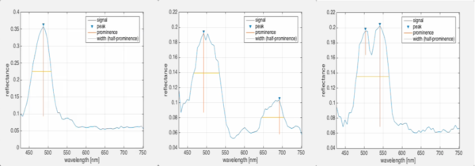

gachine Learning for Bio-inspired Photonics
==================================
### Dr Gen Kamita 
### Bio-inspired Photonics group, Cambridge

>*<strong>Left:</strong> Berries of Pollia Condensata1. <strong> Right:</strong>  Colourful cells of Pollia taken with a microscope1.*

Brilliant colours found in nature are often not created from pigments, but are results of light interacting with extraordinarily intricate structures that are about 100 times smaller than human hair. Nature's shiniest blue fruit of Pollia Condensata, also known for its ever-lasting colour, uses cellulose microfibrils to make such structure. Inspired by the Pollia fruit, we study cellulose in order to create materials with such structural colour for sensing, security printing and other applications.

Understanding the relationship between colour and structure is important for developing our materials, but this turns out to be an extremely difficult task. This is because bio-photonic structures often incorporate complicated features, which makes the materials difficult to analyse optically. In order to build optical models that truly represent our materials, it is important to understand their structures in small regions and also characterise the overall trend of the material. However, conventional methods for optical modeling are not very useful for solving this problem, because they are difficult to automate due to the reasons mentioned above. 

This type of difficulty is caused by a fundamental limitation of non-linear optimisation, which is the fact that the output of an optimisation process can vary a lot depending on how it's constraints (and starting points) are set. Without a method that can automatically produce good constraints for our optical modelling, the optimisation program that we use can easily fall into a "local minimum", a false solution, rather than a "global minimum", the true solution that we are looking for. This means that we cannot access the statistical properties of our materials without losing the detailed information of the structure, even though the necessary optical data are available. 

To solve this dilemma, I developed a powerful machine-learning technique that allows automatic analysis of complicated optical data. Unlike other mathematical methods, machine-learning algorithms excel in pattern recognition. Considering our optical signals as patterns, a machine-learning algorithm can classify the signals based on the features they have. For example, an artificial neural network, which is an algorithm that is used in this study, can be trained to recognise the difference between signals that have one peak and two peaks, without being fooled by less important features such as noise and small amplitude oscillations. Based on the determined classification, we can generate constraints that can be used for the optimisation process that follows afterwards.

>*Peak detection results. The detected peaks are indicated by orange and yellow lins. <strong>Top:</strong> One peak. <strong>Middle:</strong> Two peaks. <strong>Bottom:</strong> Two peaks merging.*

The above picture shows results of machine learning driven peak detection. It can be seen that only pronounced peaks are picked up regardless of where it appears, even when there are two peaks that are comming very close to each other (for more details, please see DetectionProcess.mp4 in this repo). Based on these results, we can create maps and histograms that show the detailed optical character and the statistical character of our sample as shown bellow. A clear correlation is seen between the features in the photograph and the maps, from which we can understand the underlying structural properties in great detail.

>*Analysis results that shows detailed optical properties of the material. <strong>Top-left:</strong> Photograph of the actual sample. <strong>Top-right:</strong> Image reconstructed from optical measurements. Regions with two peaks are indicated with colours corresponding to the detected peak wavelength. A clear correlation between the patterns shown in this graph and the photograph is seen. <strong>Bottom-left:</strong> Stacked bar chart of detected peak wavelenth. <strong>Bottom-right:</strong> Stacked bar chart of detected peak intensity.*

We believe that this study is going to be the first example that shows how machine learning can be used for optical data analysis and how powerful it can be. This technique can be applied for many other problems that are difficult to solve by conventional methods, for example for time series analysis.

1. Vignolini, S. et al. (2012). Pointillist structural color in Pollia fruit. Pnas, 109(39), 15712–15715.

---
## EDIT
Data used for this study has been added, see directory "data".
For those who attempt to replicate this work, a description of the method that I used is given in the following.

The method itself is quite straightforward.
Starting with a set of spectra taken with a 2D scanner, which contains 2601 spectra in total, I did some resampling and extracted about 10% of the spectra.
In order to get the best performance, the resampling was done with even spacing.
For example, a spactrum (column) can be resampled for every 10 spectra (10 columns) from data/spectra.csv.
Then, I manually labeled these resampled spectra and used it for training my 1-peak/2-peak classifier.
I also did some data augmentation in order to increase the amount of labeled data, which helped enhance the accuracy of the model.
Using the trained model, I classified the entire dataset.
I then used the output of the classification to perform further analysis, such as peak detection as shown above.

**note: This repo was forked from https://git.uis.cam.ac.uk/x/ch-vignolini/u/gk298/machineLearning_for_bioPhotonics.git

